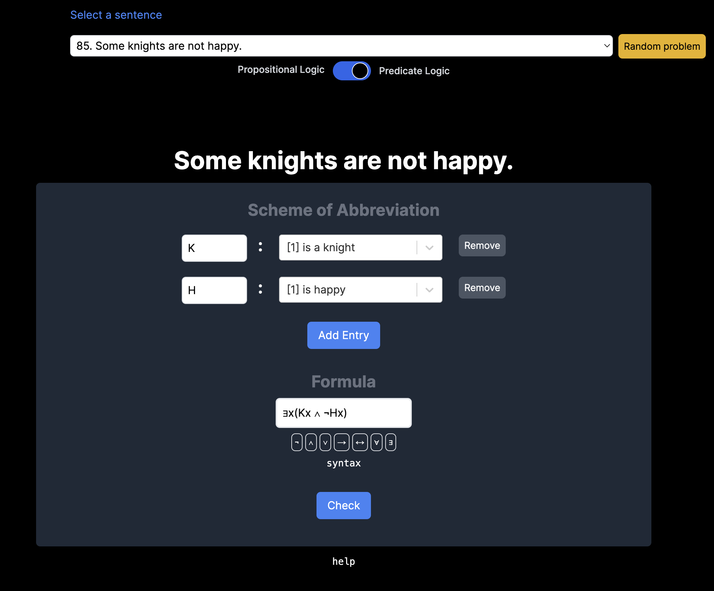

# symbolify_it

This application serves as an interactive interface for practicing propositional and predicate logic symbolization exercises. Symbolization exercises involve translating sentences from Natural Language (in this case English) into the relevant formal language.

## Table of Contents

- [Introduction](#introduction)
- [Features](#features)
- [Technologies](#technologies)
- [Usage](#usage)
- [Contributing](#contributing)
- [License](#license)

## Introduction

The symbolify_it app enables users to practice their logic symbolization skills by translating English sentences into the corresponding formal language representations. Whether you're a student learning logic or someone interested in formal language translation, symbolify_it should provide an intuitive platform for honing your skills. For example, here are a few examples of sentences you can practice translating using the app:

1. "No person who is either a student or a teacher talked to Alfred."
2. "Everyone loves someone."

## Features

- Translate English sentences into formal logic representations.
- Check the grammaticality of user inputs using Nearely.js parser.
- Verify logical equivalence between user inputs and correct answers using the Z3 Theorem Prover.
- Recognize structural ambiguities and provide correct translations for disambiguation.
- Expansive library with over 100 sentences for translation, expandable with ease.
- User-friendly interface built with React and Next.js, ensuring a smooth user experience.
- Styled with Tailwind CSS for a visually appealing design.

## Technologies

The symbolify_it app is built using a variety of technologies to provide a powerful and user-friendly experience:

- **React and Next.js:** The app's front-end is developed using React and Next.js, ensuring efficient rendering and seamless navigation.

- **Typescript:** Makies it more maintainable and less prone to errors.

- **Python:** Python plays a crucial role in this app by powering the serverless functions used for the Z3 Theorem Prover.

- **Nearely.js Parser:** This parser generates Abstract Syntax Trees from user inputs, allowing for grammaticality checks and detailed error messages.

- **Z3 Theorem Prover:** Leveraging Z3's capabilities, the app's semantic evaluator verifies logical equivalence between user inputs and correct answers.

- **Tailwind CSS:** Tailwind CSS is used for styling, ensuring a clean and modern design.

## Usage

To use the Symbolify_It app, simply visit the deployed version at [https://symbolizations.vercel.app/](https://symbolizations.vercel.app/). If you'd like to run it locally or explore the code, follow these steps:

1. Clone the repository to your local machine.
2. Install the necessary dependencies using `npm install'.
3. Run the app using `npm run dev'.
4. Access the app through your browser at [http://localhost:3000](http://localhost:3000) (note that the API using the serverless function supporting Z3 will need to be set up accordingly).

## Instructions

The task for these symbolization problems is to provide a translation of the English sentence into the relevant formal language (propositional or predicate logic).

1. **Scheme of Abbreviation:** Enter a scheme of abbreviation, which is like the translation manual for the simple expressions. Choose a symbol and its corresponding simple English expression from the dropdown menu.

2. **Formal Sentence:** Type in the formal sentence (of propositional logic or predicate logic) that translates the English sentence based on the scheme of abbreviation. The syntax for propositional logic is like this: "¬P", "(P→¬Q)", "((¬S→R)∨P)", etc. The syntax for predicate logic is like this: "¬Fab", "∀x(Fx→Gx)", "∃x(Fx∧∀y(Gy→Hxy))", etc.

For example, for the English sentence "Sam didn't sing," one could choose "P" to stand for "Sam sang," and then enter "¬P" as the propositional logic symbolization. Or for predicate logic, one could choose "a" for "Sam," "F" for "sang," and then enter "¬Fa" as the predicate logic symbolization.

The logical symbols can be entered by clicking the button or by typing the relevant keys on your keyboard, for example:

- ¬ : ~, \neg
- ∧ : &, ·, \wedge
- ∨ : ||, +, \vee
- → : ->, \to, \rightarrow
- ↔ : <->, \leftrightarrow
- ∀ : !, \forall
- ∃ : ?, \exists

Note: Any translation that is logically equivalent to a correct symbolization (modulo alphabetic variance) is correct.

## Contributing

Contributions to symbolify_it are welcome! If you find any bugs, want to add more sentences to the library, or have ideas for new features, feel free to submit requests.

## License

This project is related to the [Elogic project](https://info.elogic.land/), but this project is open and licensed under the MIT License.

-- symbolify_it :: let us calcluate! --
